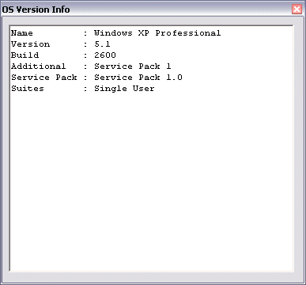

## FULL OS Version

### Description

This code illistrates how to use GetVersionEx in all OS's from Windows 95 and up. This class can detect all current OS's including Windows 95/98/ME/2000/XP and .NET (Professional / Home / Server / Enterprise / Domain Controller/ DataCenter/ Web/ Advanced) etc. It will also detect service pack's and suites installed on the machine. Addition by Ryan9999 now checks for Tablet PC 2005.
 
### More Info
 
Class.OS_Name, Class.OS_Version, Class.OS_Build, Class.OS_Additional, Class.OS_ServicePack, Class.OS_Suite

You get less info on a machine less than Windows NT 4 SP6

             |
---                |---
**Submitted On**   |2002-11-19 10:13:24
**By**             |[Riaan Aspeling](https://github.com/Planet-Source-Code/PSCIndex/blob/master/ByAuthor/riaan-aspeling.md)
**Level**          |Intermediate
**User Rating**    |5.0 (50 globes from 10 users)
**Compatibility**  |VB 6\.0
**Category**       |[Windows API Call/ Explanation](https://github.com/Planet-Source-Code/PSCIndex/blob/master/ByCategory/windows-api-call-explanation__1-39.md)
**World**          |[Visual Basic](https://github.com/Planet-Source-Code/PSCIndex/blob/master/ByWorld/visual-basic.md)
**Archive File**   |[FULL\_OS\_Ve1875924122005\.zip](https://github.com/Planet-Source-Code/riaan-aspeling-full-os-version__1-40875/archive/master.zip)

